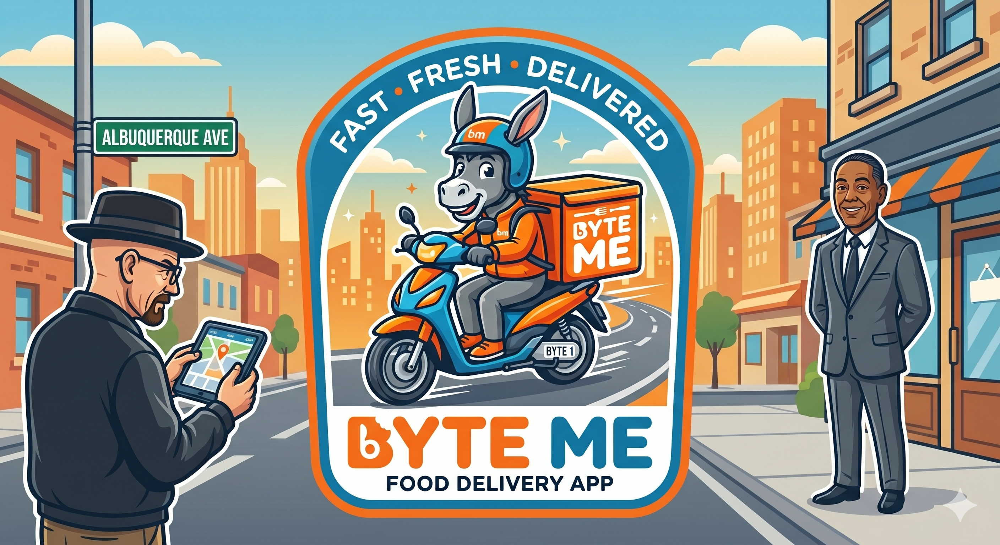
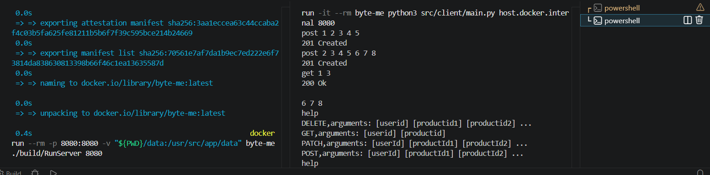
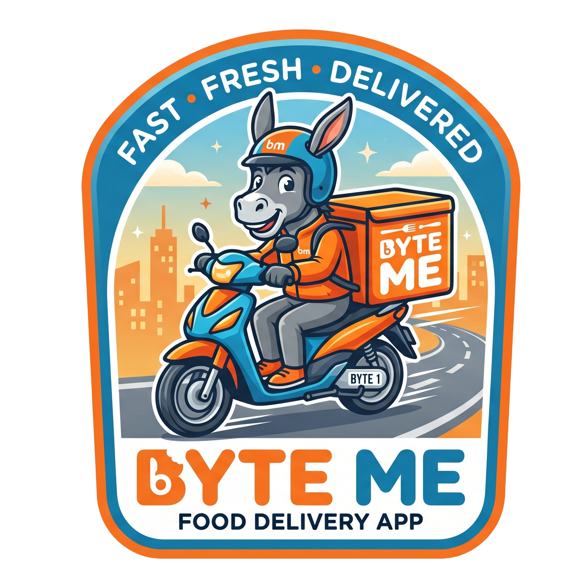

# Byte-Me



Byte-Me is a robust backend system for a food delivery application. It features a modern **Node.js/Express RESTful API** built with an **MVC architecture**, seamlessly integrated with a high-performance **C++17 Recommendation Engine** via TCP sockets. 

Given a user and a product they are viewing, the recommendation engine uses a collaborative filtering algorithm based on shared watch history with similar users to recommend up to 10 other products they might like.

> **Note:** After cloning this repository, you should rename `src/webServer/config/.env.test` to `src/webServer/config/.env`.

**For Tragil2's questions scroll to the bottom of the page.

## System Architecture
 
The project is divided into three main components:
 
1. **Web Server (Node.js/Express):** Handles all client HTTP requests using an MVC pattern. Manages Restaurants, Products, Orders, Users, Authentication, and Search. Data is stored in-memory.
2. **Recommendation Engine (C++17):** A dedicated TCP server that manages user watch histories and calculates collaborative-filtering scores to provide real-time product recommendations.
3. **Internal CLI Client (Python):** A command-line interface for testing and interacting directly with the C++ recommendation engine over a TCP socket.
---
 
## Features
 
### RESTful API (Node.js/Express)
 
| Resource | Endpoint | Description |
|---|---|---|
| Restaurants | `/api/restaurants` | Full CRUD for restaurants |
| Products | `/api/restaurants/:rId/products` | Full CRUD for products within a restaurant |
| Orders | `/api/orders` | Place, update, and delete orders |
| Users | `/api/users` | Register and retrieve users |
| Tokens | `/api/tokens` | Login and generate auth tokens |
| Search | `/api/search/:query` | Case-insensitive search across restaurants and products |
 
> See `WebServerAPICalls.md` for full request/response documentation.
 
### C++ Recommendation Engine
 
| Command | Usage | Description |
|---|---|---|
| `POST` | `post [userId] [productId1] ...` | Create a new user with an initial watch list. Fails if the user already exists. Creates products automatically if they don't exist. |
| `PATCH` | `patch [userId] [productId1] ...` | Add products to an existing user's watch list. Creates products automatically if they don't exist. |
| `DELETE` | `delete [userId] [productId1] ...` | Remove one or more products from a user's watch list. |
| `GET` | `get [userId] [productId]` | Return up to 10 recommended product IDs, ranked by score then by product ID ascending. |
| `HELP` | `help` | Print all available commands and their usage. |

### Session Example
```bash
post 1 2 3 4 5
201 Created
post 2 3 4 5 6 7 8
201 Created
get 1 3
200 Ok

6 7 8
help
DELETE,arguments: [userid] [productid1] [productid2] ...
GET,arguments: [userid] [productid]
PATCH,arguments: [userId] [productId1] [productId2] ...
POST,arguments: [userId] [productId1] [productId2] ...
help
```


## How the recommendation works

1. For the target user, compute a similarity score with every other user (count of shared products watched).
2. Among users who also watched the target product, weight each of their other watched products by the similarity score.
3. Exclude products the target user has already watched, and the target product itself.
4. Return the top 10 results sorted by score descending, then product ID ascending.

## Project Structure
 
```
Byte-Me/
├── CMakeLists.txt
├── docker-compose.yml
├── Dockerfile
├── README.md
├── WebServerAPICalls.md
├── data/
│   ├── products.txt
│   └── users.txt
├── resources/
│   └── (images & logos)
├── src/
│   ├── client/                    # Python CLI Client
│   │   ├── Dockerfile
│   │   └── main.py
│   ├── server/                    # C++17 Recommendation Engine (TCP Server)
│   │   ├── include/               # Header files
│   │   ├── App.cpp
│   │   ├── main.cpp
│   │   └── (other C++ source files)
│   └── webServer/                 # Node.js/Express REST API (MVC)
│       ├── config/                # Environment variables (.env)
│       ├── controllers/           # Request handling logic
│       ├── middleware/            # Validators & authentication
│       ├── models/                # In-memory data management
│       ├── routes/                # API endpoint definitions
│       ├── services/              # C++ TCP socket service
│       ├── app.js                 # Express entry point
│       ├── package.json
│       └── Dockerfile
└── tests/                         # C++ Unit Tests (Google Test)
```
 
---
## Building & Running
 
All three components are containerized and managed via Docker Compose.
 
**Start the servers:**
```bash
docker-compose up -d --build cpp-server web-server
```
 
**Start the Python CLI client:**
```bash
docker-compose run --rm client
```
 
**Shut everything down:**
```bash
docker-compose down
```
 
> To persist data between restarts, see the commented `volumes` section in `docker-compose.yml`.
 
---

## Q n A
- Q1: Did the fact that command names changed require you to modify code that should be "closed for modification but open for extension"?
- Answer: No! we define our commands names in the command mannager, so no command class was needed to be openned for this chage.
---
- Q2: Did the fact that new commands were added require you to modify code that should be "closed for modification but open for extension"?
- Answer: No! again, thanks to our command mannager class, we add to our map every new command and the rest takes care of itself thanks to our implementations of searching command name in a map instead of using switch case.
---
- Q3: Did the fact that the commands' output changed require you to modify code that should be "closed for modification but open for extension"?
- Answer: unfortunatly yes, because the output was integrated part of our commands, now we implemented IFormatter that takes the HTTP code, and the logical output of the command, and builds an output from it, so if we need to change it in the future again, we just need to implement a new formatter and pass it thorugh main
---
- Q4: Did the fact that input/output now comes from sockets instead of the console require you to modify code that should be "closed for modification but open for extension"?

- Answer: No. we implemented IIOhandler interface, and Console that implementes it in Assignment 1 that prints to the console, for this assignment all we had to do is create SocketHandler that implements IIOHandler and pass it as the IO handler for our App in main.


